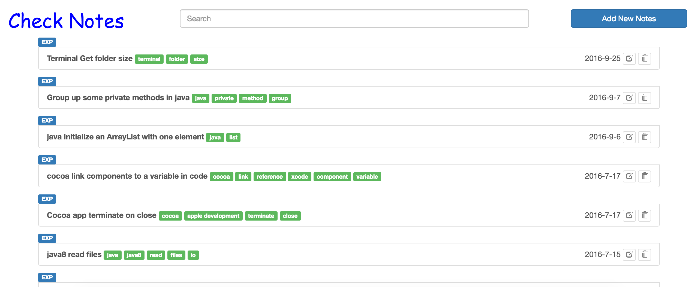
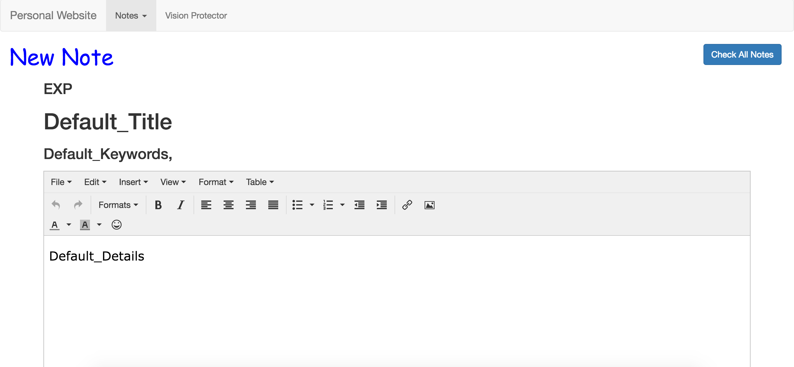

# My Web Toolbox
I love developing web apps! When there are too many of them, I need a place to collect them all, and this is what I get - My Web Toolbox! It collects and organizes those small apps I made for myself to assist me in daily task. You can check them out at
[Heroku](https://duosapp.herokuapp.com/).

I am sorry the video is outdated. I should have get a new one, but I am too busy these days.
## Completed Apps

1. Home Page

2. Tech Notebook
 * Check the Notes

 * Take new Notes

3. Vision Protector

## Frameworks & Database
Node.js & Jquery & MongoDB

## Contact
If you have any questions: feel free to email me at taod@carleton.edu.
Thank you!
Duo Tao
